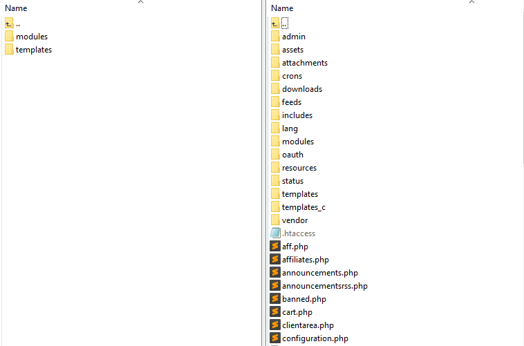
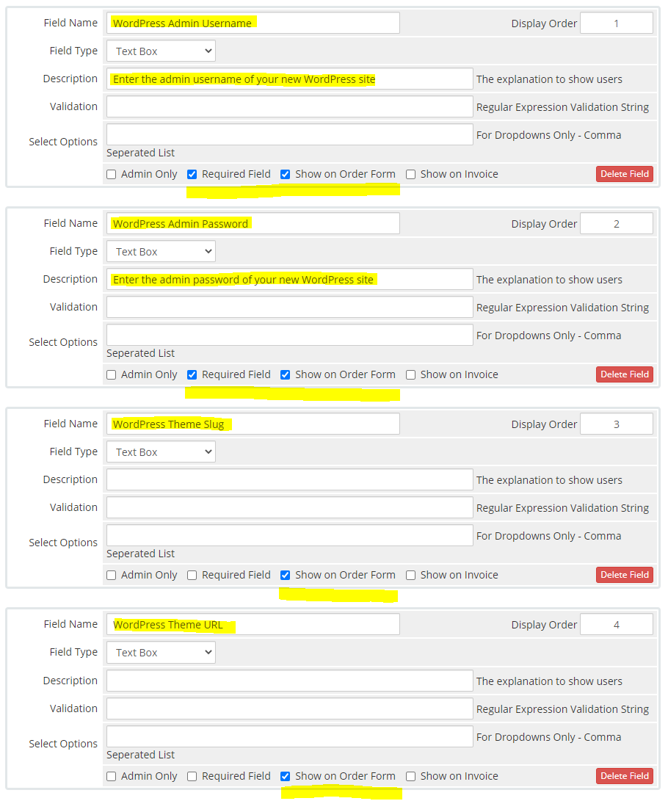
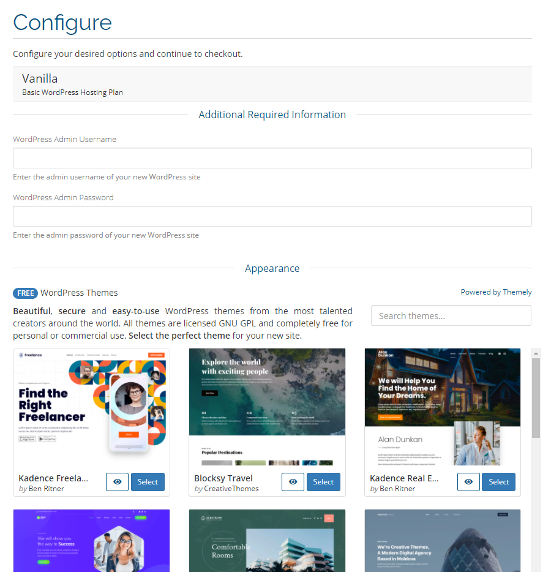
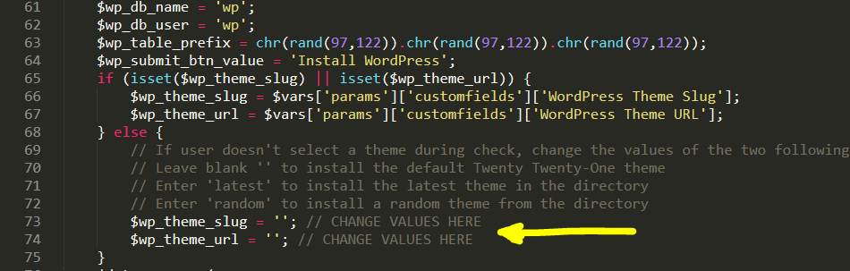

# Themely WHMCS Addon Module

## Integrate Themely cPanel plugin with WHMCS
#### Display themes during checkout and automatically install selected theme and WordPress for new accounts.

## Installation Instructions

**Step 1**

- [Download the contents of this repository](https://github.com/ismaelyws/themely-whmcs-module/archive/master.zip)
- Unzip the file
- Locate the **whmcs** folder

**Step 2**

To install the module it will need to be uploaded to your WHMCS installation. Upload the contents of the **whmcs** folder which contains the **modules** & **templates** folders to the root directory of your WHMCS installation location. Once uploaded the addon will be available within your admin area.

**Step 3**

- Navigate to **Configuration (🔧) > System Settings > Addon Modules** or, prior to WHMCS 8.0, **Setup > Addon Modules**, and the module will be listed.
- Click **Activate** next to Themely. The module is now active within your WHMCS.
- Click **Configure** and select which administrator roles you wish to have access to the module by enabling them under the Access Control section.

**Step 4**

- Navigate to **Configuration (🔧) > Products & Services > Products & Services**.
- Click the edit icon for the product you wish to configure. Then, click on **Custom Fields**.

**Step 5**
 
Create 4 custom fields for the WordPress Admin Username, Admin Password, Theme Slug and Theme URL. Field names **must be exactly** as you see below (upper and lowercase characters do matter).

`WordPress Admin Username`

`WordPress Admin Password`

`WordPress Theme Slug`

`WordPress Theme URL`

Select **Show on Order Form** for all custom fields.

Select **Required Field** ONLY for the Admin Username and Password.

NOTE: The module requires the Theme Slug and Theme URL custom fields but they won't be visible to clients during checkout. These fields will remain hidden and when a client selects a theme our module will pass those variables to the form.

## Configuration Instructions

If a client doesn't select a theme during checkout you can select which theme will be installed by default by editing the `hooks.php` file located in this folder `[WHMCS_ROOT]/modules/addons/themely/`.

Configuration options are found on line 73-74.

## Get Help/Support

To get assistance or to suggest new features; here's how you can reach us:

[Create new issue on Github](https://github.com/ismaelyws/themely-whmcs-module/issues) (click the green **New Issue** button)

[Chat with us on Discord](https://discord.gg/f3m2Pmp)

Send an email to `hans@themely.com`

Call or text on Whatsapp `+1 (514) 883-0132`

Time Zone: Eastern Standard Time (GMT -4)

Spoken & written languages: English, Français, Español (un poquito)

Office Location: Montreal, Canada